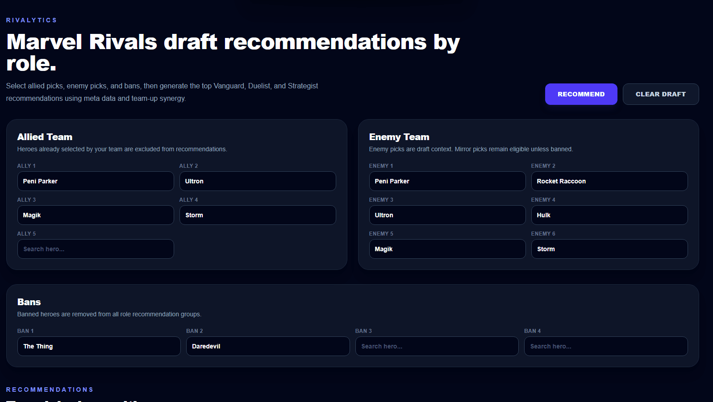

# 🎮 Rivalytics

A full-stack Marvel Rivals analytics and recommendation platform that ingests live hero and team-up statistics, persists normalized meta data in PostgreSQL, and generates role-specific draft recommendations through a cloud-ready recommendation engine.

This project was intentionally designed to emphasize:

- data ingestion and web scraping pipelines
- REST API design and service-oriented architecture
- PostgreSQL relational modeling
- recommendation system development
- data normalization and validation workflows
- frontend/backend integration
- containerized deployment

---
## Current Status

**Portfolio MVP / Dockerized Full-Stack Application**

Current functionality includes:

- Marvel Rivals hero recommendation engine
- Role-specific top 3 recommendations
- Draft-aware filtering for allied picks and bans
- Hero and team-up metadata persistence in PostgreSQL
- RivalsMeta ingestion pipeline for hero/team-up statistics
- Data normalization and Pydantic validation workflows
- FastAPI REST API
- Next.js frontend dashboard
- Docker Compose local deployment

---

## Demo Media

**Recommendation Workflow**



---

## Features

- **Meta Data Ingestion Pipeline**
  - Scrapes hero and team-up statistics from external Marvel Rivals data sources
  - Normalizes raw source data into application-ready records
  - Validates ingestion payloads before persistence
- **Recommendation Engine**
  - Generates role-specific hero recommendations
  - Combines hero performance metrics with team-up synergy data
  - Produces top recommendations for Vanguard, Duelist, and Strategist roles
- **Draft-Aware Filtering**
  - Excludes already selected allied heroes and banned heroes from recommendation path
  - Incorporates current draft context into recommendation generation
- **PostgreSQL Persistence Layer**
  - Stores hero statistics and team-up relationships
  - Supports repeatable ingestion workflows through upsert operations
  - Maintains normalized relational data structures
- **REST API**
  - FastAPI-powered recommendation endpoints
  - Consistent request/response schemas
  - Environment-based configuration and error handling
- **Interactive Draft Dashboard**
  - Next.js frontend for team selection and draft analysis
  - Real-time recommendation generation
  - Role-based recommendation views and hero performance metrics
- **Containerized Deployment**
  - Dockerized frontend and backend services
  - Docker Compose local development environment
  - Environment-driven configuration for deployment portability

---

## Architecture Overview
```txt
External Marvel Rivals Meta Sources
            ↓
HTTP Client Layer
            ↓
HTML Scraping Pipeline
            ↓
Normalization + Validation
            ↓
PostgreSQL Database (Neon)
            ↓
Recommendation Engine
            ↓
FastAPI REST API
            ↓
Next.js Frontend Dashboard
            ↓
Role-Based Draft Recommendations            
```
---


## Developer Contributions

This project was independently designed and implemented with a strong emphasis on backend engineering, data pipelines, and recommendation systems:

- Designed a **PostgreSQL relational schema** to model:
  - Hero performance statistics
  - Team-up relationships and synergy data
  - Source metadata and ingestion records
  - Normalized recommendation inputs
- Built a **FastAPI REST API** to support:
  - Hero metadata retrieval
  - Recommendation generation workflows
  - Frontend consumption through typed request/response contracts
  - Environment-based configuration and predictable API behavior
- Implemented a **web scraping and ingestion pipeline** that:
  - Retrieves hero and team-up statistics from external Marvel Rivals data sources
  - Extracts structured data from raw HTML pages
  - Normalizes source records into application-specific formats
  - Validates ingestion payloads prior to persistence
- Developed a **recommendation engine** that:
  - Generates role-specific hero recommendations
  - Combines hero performance metrics with team-up synergy data
  - Excludes banned heroes and already-selected allied heroes
  - Produces ranked recommendation outputs for draft decision support
- Applied **service-oriented architecture principles** by separating:
  - Data acquisition
  - Parsing and extraction
  - Normalization and validation
  - Database persistence
  - Recommendation logic
  - API presentation
- Ensured deployment portability through:
  - Environment-based configuration
  - Containerized application services
  - Docker Compose local orchestration
  - Clear separation of frontend and backend responsibilities
- Containerized frontend and backend services using Docker to support reproducible local development and deployment workflows.

---

## Technologies and Tools Used

- **Python** (backend application logic)
- **FastAPI** (REST API)
- **Neon PostgreSQL** (persistent relational storage)
- **SQLAlchemy** (ORM + query layer)
- **Pydantic** (data validation and schema enforcement)
- **Requests** (HTTP client for external data retrieval)
- **BeautifulSoup4** (HTML parsing and web scraping)
- **Next.js / React** (frontend application)
- **TypeScript** (frontend type safety)
- **Docker** (containerization)
- **Git/GitHub** (version control and repository management)

---

## Docker Setup

Run the entire application stack:

```bash
docker compose up --build
```

Services:

- Frontend: localhost:3000
- Backend: localhost:8000

---

## Assumptions & Limitations

- Recommendations are generated using publicly available hero performance and team-up statistics.
- Direct hero-versus-hero counter data is not currently available from the source provider and is therefore not incorporated into recommendation scoring.
- Recommendation quality depends on the accuracy and availability of external Marvel Rivals metadata sources.
- Automated scheduled ingestion is planned for a deployed version but is not currently implemented.
- Recommendations prioritize overall hero performance and team-up synergy rather than player-specific skill, rank, or play-style preferences.

---
## Project Structure

```text
.
├── backend/
│   ├── app/
│   │   ├── db/
│   │   ├── models/
│   │   ├── routes/
│   │   ├── schemas/
│   │   └── services/
│   │       └── ingestion/
│   │
│   ├── scripts/
│   │   ├── download_hero_images.py
│   │   ├── reset_db.py
│   │   └── sync_rivalsmeta.py
│   │
│   ├── Dockerfile
│   ├── requirements.txt
│   └── main.py
│
├── frontend/
│   ├── public/
│   │   └── heroes/
│   │
│   ├── src/
│   │   ├── app/
│   │   │   ├── _components/
│   │   │   ├── layout.tsx
│   │   │   └── page.tsx
│   │   │
│   │   └── types/
│   │
│   ├── Dockerfile
│   ├── package.json
│   └── tsconfig.json
│
├── docker-compose.yml
└── README.md
```
---

## How to Run Locally

1. Clone the repository
```bash
git clone https://github.com/hjlinto/rivalytics
```
2. Configure environment variables

Backend (`backend/.env`):

```env
DATABASE_URL=your_postgresql_connection_string
```

Frontend (`frontend/.env.local`):

```env
NEXT_PUBLIC_API_BASE_URL=http://localhost:8000
```

3. Start the application

```bash
docker compose up --build
```

4. Open the application

- Frontend: http://localhost:3000
- Backend API: http://localhost:8000
- API Documentation: http://localhost:8000/docs

5. Stop the application

```bash
docker compose down
```

---

## Reflections

- Implement automated scheduled ingestion to keep hero and team-up statistics synchronized with external data sources without manual intervention.
- Introduce hero counter-matchup analysis when reliable matchup data becomes available to improve recommendation quality.
- Add rank-specific recommendation weighting to better reflect differences in competitive play environments.

---

## Author

Created by **Hunter J. Linton**
